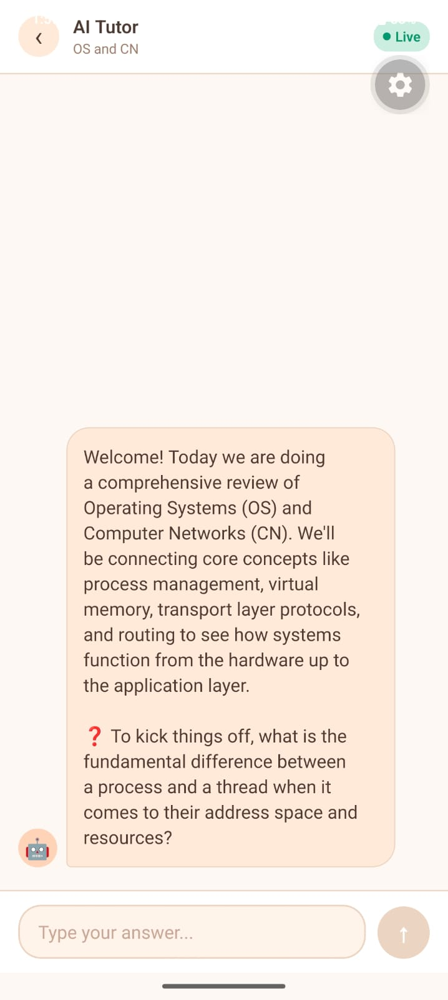
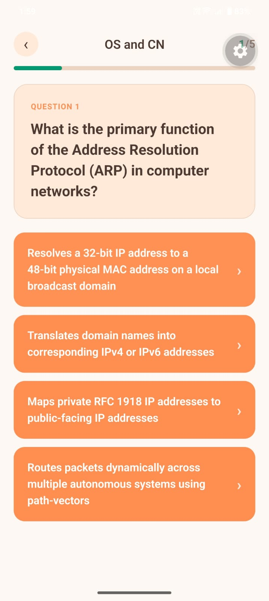
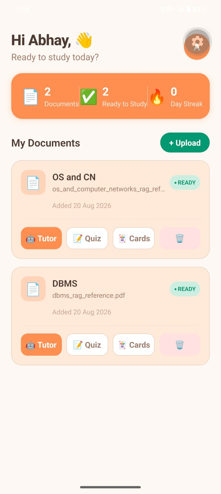

# AI Study Saathi 🧠📚

**AI Study Saathi** is an intelligent, RAG-driven study companion. It consists of a robust backend engine powered by Node.js, Express, and PostgreSQL (`pgvector`), and a beautiful, organic mobile frontend built with React Native and Expo. 

This repository contains both the **Frontend** and **Backend** source code.

---

## 🏗️ Backend Architecture & RAG Pipeline

Our backend is built around a robust Retrieval-Augmented Generation (RAG) architecture. When a user uploads a study document (PDF/TXT), the following pipeline is executed:

1. **Ingestion & Chunking**: The document is parsed using `pdf-parse`, and split into semantically meaningful chunks using LangChain's `RecursiveCharacterTextSplitter`.
2. **Vectorization**: Each chunk is embedded using Google's `text-embedding-004` model.
3. **Storage**: Vectors and metadata are stored natively in our PostgreSQL database using the `pgvector` extension via Prisma's typed client.
4. **Retrieval**: When a feature is triggered, `PGVectorRetriever` performs a cosine-similarity search to pull the most relevant context chunks for the LLM.

---

## 📱 Frontend & Core AI Features

The mobile app is built with **React Native** and **Expo**, utilizing a custom warm, organic design system.

### 1. The Interactive AI Tutor (Powered by LangGraph)



Unlike a standard stateless chatbot, the AI Tutor uses **LangGraph** to maintain a stateful, cyclical graph architecture. 
- **State Management**: It tracks `conversationHistory`, `currentConcept`, `questionCount`, and `weakAreas` in memory across graph nodes.
- **Dynamic Routing**: Depending on the user's answer, LangGraph dynamically routes the execution flow:
  - If the user understands the concept ➡️ Moves to the next concept.
  - If the user struggles ➡️ Routes to an "explain again" node using simpler terms.
- **UI Experience**: A real-time chat interface featuring animated typing indicators and live session tracking.

---

### 2. Dynamic Quizzes (Powered by LangChain + Zod)



Our quiz generator doesn't just ask the LLM to "write some questions." It uses **LangChain's `StructuredOutputParser`** combined with **Zod Schemas** to enforce strict JSON structural integrity.
- **Randomization**: A mathematical seed is injected into the prompt template alongside a high temperature (`0.8`), forcing the LLM to retrieve a completely varied subset of facts from the `PGVectorRetriever` on every request.
- **UI Experience**: Highly interactive pill-shaped options that use `Animated` spring physics to scale on press, turning green or red based on the correct schema validation.

---

### 3. Smart Flashcards (Powered by RAG Context)


The flashcard generator utilizes a LangChain `RunnableSequence` to pipe retrieved vector context into an optimized prompt template. 
- It automatically generates contextual "hints" and cites the original source document for every card, proving the RAG pipeline's traceability.
- **UI Experience**: Utilizes React Native's `Animated.View` with 3D interpolation (`rotateY`) to create a satisfying, realistic 180-degree card flip animation.

---

### 4. Smart Dashboard (Document Processing)



The dashboard serves as the central hub where users manage their study materials. 
- Documents are processed asynchronously in the background, updating their status from `PROCESSING` to `READY` once the text extraction, chunking, and vector embedding pipelines are complete.
- **UI Experience**: A clean, organic dashboard built with `SafeAreaView` and `FlatList`, displaying dynamic user stats, document status badges, and easy action triggers.

---

## 🚀 Getting Started (Local Development)

### 1. Backend Setup

**Prerequisites:** Node.js (v18+), PostgreSQL with `pgvector`, Gemini API Key.

```bash
cd backend
npm install
```
- Copy `.env.example` to `.env` and configure your Database URL and Gemini API Key.
- Run `npx prisma generate` and `npx prisma db push`.
- Start the server:
```bash
npm run dev
```

### 2. Frontend Setup

**Prerequisites:** Expo CLI, Expo Go app (for physical device testing).

```bash
cd frontend
npm install
```
- Create a `.env` file in the frontend directory and add your backend URL:
  `EXPO_PUBLIC_API_URL="http://<YOUR_LOCAL_IP>:5000/api"`
- Start the Expo bundler:
```bash
npm start
```
- Scan the QR code using the Expo Go app on your phone!


